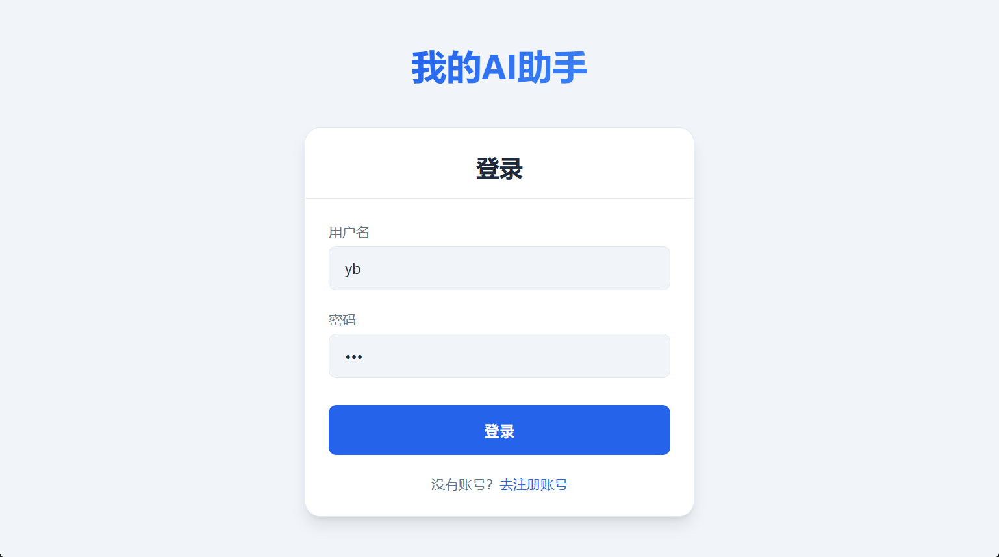
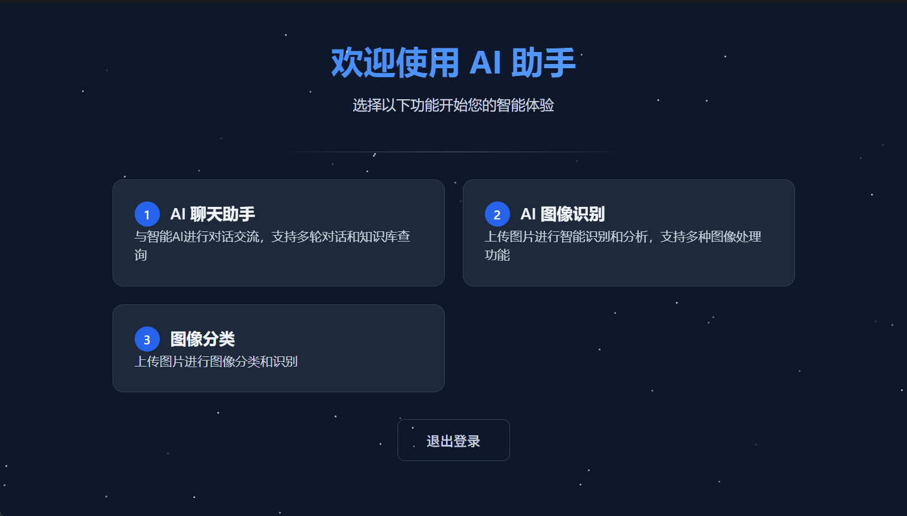
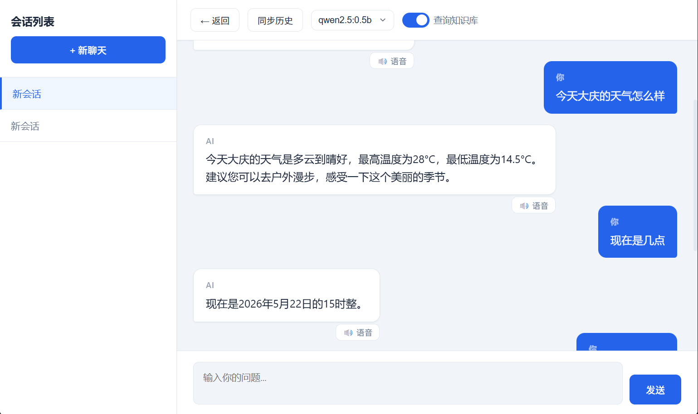
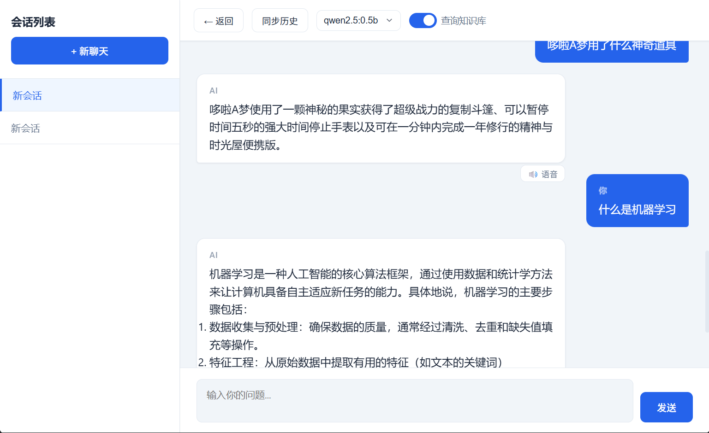
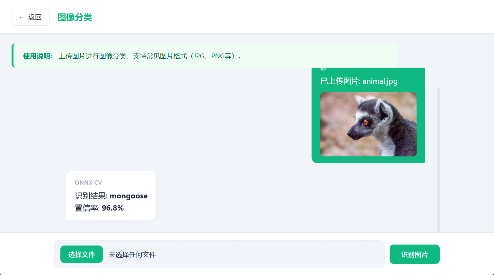
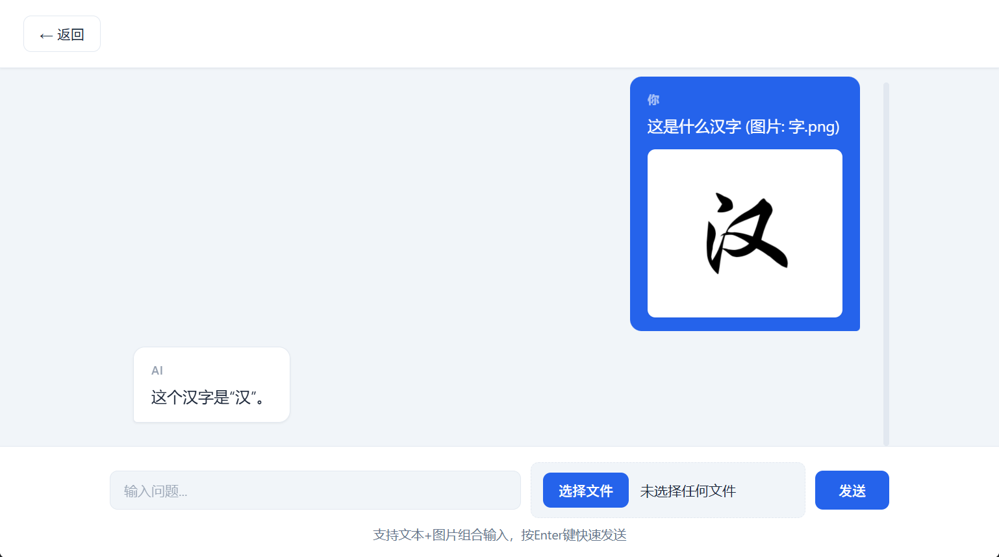

# AIService - 企业级AI智能助手平台
Please visit the address below to view the latest updates:
[Click here to access the project](https://gitee.com/youwangbei/aiserver)
<div align="center">

**基于 C++ 17的高性能全栈 AI 服务平台**

[](https://en.cppreference.com/w/cpp/17)
[](https://github.com/chenshuo/muduo)
[](https://onnxruntime.ai/)
[](https://www.trychroma.com/)
[](https://www.rabbitmq.com/)

</div>

---

## 项目简介

**AIService** 是一套从底层 HTTP 服务器框架到上层 AI 应用的企业级 AI 智能助手中台。项目采用 C++17 编写核心服务，结合 Python 生态的 AI 模型能力，实现了智能对话、图像识别、语音合成、RAG 知识库检索等功能。整体架构以 muduo 网络库为基石，配合路由系统、中间件链、会话管理和数据库连接池，构建了一个稳定、高性能、易扩展的 AI 服务平台。

---

## 目录

- [核心特性](#核心特性)
- [系统架构](#系统架构)
- [项目结构](#项目结构)
- [技术栈详解](#技术栈详解)
- [快速开始](#快速开始)
- [功能演示](#功能演示)
- [API 接口](#api-接口)
- [核心模块剖析](#核心模块剖析)
- [配置说明](#配置说明)
- [部署方案](#部署方案)

---

## 核心特性

<table>
<tr>
<td width="50%">

### 多模态 AI 能力

| 能力 | 实现方式 |
|------|----------|
| 智能对话 | Qwen / Ollama 多模型，多轮记忆 |
| 图像识别 | ResNet50 + ONNX Runtime |
| 语音合成 | Edge TTS / Google TTS / pyttsx3 |
| 知识检索 | ChromaDB + M3E-Small 向量嵌入 |
| 工具调用 | Function Calling 天气/时间/搜索 |
| 图文混合 | 图片+文本联合输入理解 |

</td>
<td width="50%">

### 企业级架构特性

| 特性 | 技术方案 |
|------|----------|
| 高并发 | muduo Reactor + 线程池 |
| 异步任务 | RabbitMQ 消息队列 |
| 会话管理 | Cookie/Session + 内存存储 |
| 数据持久化 | MySQL 连接池 + CRUD |
| 跨域支持 | CORS 中间件 |
| 策略扩展 | 工厂模式 + 模板注册 |

</td>
</tr>
</table>

---

## 系统架构

```
                               Browser / Client
                                     │
                              HTTP / WebSocket
                                     │
┌────────────────────────────────────▼─────────────────────────────────────┐
│                         HttpServer (C++ / muduo)                          │
│  ┌──────────────┐  ┌──────────────┐  ┌──────────────┐  ┌──────────────┐  │
│  │   Router     │  │  Middleware  │  │   Session    │  │    SSL       │  │
│  │  (RESTful)   │  │  (CORS)      │  │  (Memory)    │  │  (Optional)  │  │
│  └──────────────┘  └──────────────┘  └──────────────┘  └──────────────┘  │
└────────────────────────────────────┬─────────────────────────────────────┘
                                     │
┌────────────────────────────────────▼─────────────────────────────────────┐
│                           ChatServer (业务核心)                           │
│  ┌────────────────────────────────────────────────────────────────────┐  │
│  │                    Handler Layer (17 Handlers)                      │  │
│  │  Chat  │ Speech │ CV Upload │ History │ Session │ Login │ Register │  │
│  └────────────────────────────────────────────────────────────────────┘  │
│  ┌────────────────────────────────────────────────────────────────────┐  │
│  │                       AI Core Engine                                │  │
│  │  AIHelper │ AIStrategy │ AIToolRegistry │ MQManager │ AsyncTask    │  │
│  └────────────────────────────────────────────────────────────────────┘  │
└──────────┬──────────────────┬───────────────────┬────────────────────────┘
           │                  │                   │
┌──────────▼──────┐  ┌────────▼───────┐  ┌────────▼──────────┐
│   Ollama API    │  │  ONNX Runtime  │  │   ChromaDB        │
│  (Qwen/VL/2.5)  │  │  (ResNet50)    │  │  (M3E-Small)      │
└─────────────────┘  └────────────────┘  └───────────────────┘
           │                  │                   │
┌──────────▼──────────────────▼───────────────────▼────────────────────────┐
│                         External Services                                 │
│   百度语音 API  │  Edge TTS  │  Google TTS  │  RabbitMQ  │  MySQL         │
└──────────────────────────────────────────────────────────────────────────┘
```

### 架构分层说明

| 层级 | 组件 | 职责 |
|------|------|------|
| **接入层** | `HttpServer` | HTTP 协议解析、路由分发、中间件过滤、会话管理、SSL 加密 |
| **业务层** | `ChatServer` + Handlers | 请求路由注册、用户认证、聊天流程编排、文件上传处理 |
| **引擎层** | `AIHelper` / `AIToolRegistry` | AI 模型调用、工具函数执行、RAG 检索、对话历史管理 |
| **策略层** | `AIStrategy` / `StrategyFactory` | 多模型抽象与切换、请求构建、响应解析 |
| **数据层** | MySQL / ChromaDB / RabbitMQ | 对话持久化、向量存储与检索、异步消息传递 |

---

## 项目结构

```
AIService/
│
├── HttpServer/                         # ★ C++ HTTP 服务器框架
│   ├── include/
│   │   ├── http/                       # HTTP 协议栈
│   │   │   ├── HttpServer.h            # 服务器核心（基于 muduo）
│   │   │   ├── HttpContext.h           # 上下文解析
│   │   │   ├── HttpRequest.h           # 请求封装
│   │   │   └── HttpResponse.h          # 响应封装
│   │   ├── router/
│   │   │   ├── Router.h                # 路由表 + 正则匹配
│   │   │   └── RouterHandler.h         # 处理器基类
│   │   ├── session/
│   │   │   ├── SessionManager.h        # 会话管理器
│   │   │   ├── Session.h               # 会话对象
│   │   │   └── SessionStorage.h        # 存储后端接口
│   │   ├── middleware/
│   │   │   ├── MiddlewareChain.h       # 中间件链
│   │   │   ├── Middleware.h            # 中间件接口
│   │   │   └── cors/CorsMiddleware.h   # CORS 中间件
│   │   ├── ssl/                        # SSL/TLS 支持
│   │   └── utils/
│   │       ├── MysqlUtil.h             # MySQL 工具（含连接池）
│   │       ├── JsonUtil.h              # JSON 工具（nlohmann）
│   │       ├── FileUtil.h              # 文件工具
│   │       └── db/                     # 数据库连接池
│   └── src/                            # 对应实现文件
│
├── AIApps/                             # ★ AI 应用层
│   ├── include/
│   │   ├── ChatServer.h                # 聊天服务器主控（核心大脑）
│   │   ├── AIUtil/
│   │   │   ├── AIHelper.h              # AI 对话引擎（模型调用+工具链）
│   │   │   ├── AIStrategy.h            # 策略模式（多模型抽象）
│   │   │   ├── AIFactory.h             # 策略工厂 + 自动注册
│   │   │   ├── AIConfig.h              # JSON 配置加载器
│   │   │   ├── AIToolRegistry.h        # 工具注册与调用（Function Calling）
│   │   │   ├── ImageRecognizer.h       # ONNX 图像识别
│   │   │   ├── AISpeechProcessor.h     # 百度语音 API 封装
│   │   │   ├── LocalTTSProcessor.h     # 本地 TTS 客户端
│   │   │   ├── AISessionIdGenerator.h  # 会话 ID 生成器
│   │   │   ├── MQManager.h             # RabbitMQ 管理器
│   │   │   ├── MQConsumerService.h     # 消息消费服务
│   │   │   ├── AsyncTaskManager.h      # 异步任务管理器
│   │   │   └── base64.h               # Base64 编解码
│   │   └── handlers/                   # ★ 17 个 HTTP 请求处理器
│   │       ├── ChatHandler.h           # GET /chat
│   │       ├── ChatSendHandler.h       # POST /chat/send（核心对话）
│   │       ├── ChatCreateAndSendHandler.h  # POST /chat/send-new-session
│   │       ├── ChatSessionsHandler.h   # GET /chat/sessions
│   │       ├── ChatHistoryHandler.h    # POST /chat/history
│   │       ├── ChatSpeechHandler.h     # POST /chat/tts（语音合成）
│   │       ├── ChatEntryHandler.h      # GET /entry
│   │       ├── ChatLoginHandler.h      # POST /login
│   │       ├── ChatRegisterHandler.h   # POST /register
│   │       ├── ChatLogoutHandler.h     # POST /user/logout
│   │       ├── AIMenuHandler.h         # GET /menu
│   │       ├── AIUploadHandler.h       # GET /upload
│   │       ├── AIUploadSendHandler.h   # POST /upload/send
│   │       ├── AICVUploadHandler.h     # GET /cv/upload
│   │       ├── AICVUploadSendHandler.h # POST /cv/upload/send
│   │       └── TaskResultHandler.h     # GET /task/result
│   ├── src/                            # 对应实现文件
│   │   └── main.cpp                    # 入口：端口监听 + 信号处理
│   └── resource/                       # ★ 资源与模型
│       ├── config.json                 # AI 工具 + Prompt 配置
│       ├── *.html                      # 前端页面（6个）
│       ├── model/
│       │   ├── resnet50.onnx           # ResNet50 模型
│       │   └── imagenet_classes.txt    # 1000 类标签
│       ├── models/
│       │   └── mobilenetv2/            # MobileNetV2 备选模型
│       ├── rag/                        # ★ RAG 知识库
│       │   ├── rag_service.py          # RAG 服务（ChromaDB 交互）
│       │   ├── preprocess.py           # 文档预处理脚本
│       │   ├── doc/                    # 知识文档目录
│       │   ├── m3e-small/              # M3E 文本嵌入模型
│       │   └── chroma_db/              # 向量数据库存储
│       └── tts/                        # ★ 语音合成
│           ├── tts_server.py           # TTS Flask 服务
│           ├── tts_requirements.txt    # Python 依赖
│           └── TTS_README.md           # TTS 使用文档
│
└── .venv/                              # Python 虚拟环境
```

---

## 技术栈详解

### 底层基础设施

| 组件 | 选型 | 理由 |
|------|------|------|
| 网络框架 | **muduo** (Reactor + one loop per thread) | Linux 下成熟的高性能 C++ 网络库，非阻塞 IO + 事件驱动 |
| HTTP 协议 | **解析栈** | 完整的 HTTP/1.1 请求解析 + 响应构建，支持分块传输 |
| 路由系统 | **Router** | 支持精确匹配、正则匹配、Method 过滤 |
| 数据库 | **MySQL 8.0 + 连接池** | 线程安全的连接池，自动重连 |
| JSON | **nlohmann/json** | Header-only，API 优雅 |
| 日志 | **muduo Logging** | 内置异步日志 |

### AI 能力层

| 能力 | 技术方案 | 关键细节 |
|------|----------|----------|
| **对话推理** | Ollama + OpenAI 兼容 API | 支持 Qwen3-VL、Qwen2.5 等模型，通过 `AIStrategy` 策略模式任意切换 |
| **Function Calling** | `AIToolRegistry` | LLM 输出 JSON tool_call → 注册表查找执行 → 结果注入二次推理 |
| **图像识别** | ONNX Runtime + ResNet50 | 输入 224x224，Top-1 分类，支持文件/Base64/Mat 三种输入 |
| **语音识别** | 百度语音 API | 支持 PCM/WAV/MP3 多格式，16kHz 采样 |
| **语音合成** | 多引擎 TTS 服务 | Edge TTS（推荐）> Google TTS > pyttsx3（离线） > Coqui TTS |
| **知识库 RAG** | ChromaDB + M3E-Small | 文档自动分块（500字/段），向量语义检索 Top-K，结果注入 System Prompt |

### 异步与消息

| 组件 | 选型 | 用途 |
|------|------|------|
| 消息队列 | **RabbitMQ** (SimpleAmqpClient) | 连接池 + 发布/订阅模式 |
| 线程池消费 | `RabbitMQThreadPool` | 多线程消费 ai_chat_queue，异步执行大模型推理 |
| 任务管理 | `AsyncTaskManager` | 创建任务 → 入队 → 消费者执行 → 结果轮询 |

---

## 快速开始

### 环境要求

| 依赖 | 版本 | 说明 |
|------|------|------|
| Linux | Ubuntu 20.04+ | muduo 依赖 Linux epoll |
| GCC | 9.0+ | C++17 特性 |
| CMake | 3.16+ | 构建系统 |
| MySQL | 8.0+ | 对话历史持久化 |
| RabbitMQ | 3.8+ | 异步任务队列 |
| Python | 3.8+ | TTS / RAG 服务 |
| Ollama | 最新版 | 本地 AI 模型运行 |

### 安装步骤

**1. 系统依赖**
```bash
sudo apt-get update
sudo apt-get install -y build-essential cmake g++ \
    libmysqlclient-dev libcurl4-openssl-dev \
    libssl-dev libboost-all-dev rabbitmq-server
```

**2. 安装 muduo 网络库**
```bash
git clone https://github.com/chenshuo/muduo.git
cd muduo && ./build.sh && sudo ./build.sh install
```

**3. Python 依赖**
```bash
cd AIService
python3 -m venv .venv
source .venv/bin/activate
pip install -r AIApps/resource/tts/tts_requirements.txt
pip install sentence-transformers chromadb flask edge-tts
```

**4. 数据库初始化**
```sql
CREATE DATABASE ChatHttpServer;
USE ChatHttpServer;

CREATE TABLE chat_message (
    id         BIGINT AUTO_INCREMENT PRIMARY KEY,
    user_id    INT NOT NULL,
    username   VARCHAR(100) NOT NULL,
    session_id VARCHAR(50) NOT NULL,
    is_user    TINYINT(1) DEFAULT 1,
    content    TEXT NOT NULL,
    ts         BIGINT NOT NULL,
    INDEX idx_user_session (user_id, session_id),
    INDEX idx_ts (ts)
);
```

**5. 编译项目**
```bash
mkdir build && cd build
cmake .. -DCMAKE_BUILD_TYPE=Release
make -j$(nproc)
```

**6. 启动服务**
```bash
# 终端1：启动 TTS 服务
cd AIApps/resource/tts
python3 tts_server.py --engine edge --port 5000

# 终端2：启动主服务器
cd build
./http_server -p 8080
```

**7. 打开浏览器访问**
```
http://localhost:8080
```

---

## 功能演示

### 1. 登录界面



> 简洁大气的白色卡片式登录界面，支持用户名密码认证及新用户注册。后端通过 `ChatLoginHandler` 和 `ChatRegisterHandler` 处理认证请求，采用 Session + Cookie 机制管理用户登录态。

### 2. 功能导航菜单



> 深色星空主题的主菜单，提供三大核心功能入口：「AI聊天助手」「AI图像识别」「图像分类」。右上角提供退出登录按钮，由 `AIMenuHandler` 渲染。

### 3. 智能对话 —— 多会话管理



> 左侧为会话列表（支持创建/切换多个独立会话），右侧为对话区域。顶部工具栏可切换 AI 模型（Qwen3-VL / Qwen2.5）、开启/关闭知识库检索。支持多轮上下文记忆，每次对话写入 MySQL 持久化。

### 4. RAG 知识库检索 —— "什么是机器学习"



> 当用户提问时，系统通过 `queryRAGDatabase()` 调用 ChromaDB 进行语义检索，将相关文档片段注入 System Prompt。AI 基于知识库内容生成精准、结构化的分点回答。支持 .md / .txt / .json / .csv 多格式文档导入。

### 5. 图像分类 —— 猫鼬识别（96.8%）



> 专属的图像分类页面，采用绿色主题区分功能区域。用户上传图片后，`AICVUploadSendHandler` 接收 Base64 图像数据，调用 ONNX Runtime 加载 ResNet50 模型进行推理，返回分类标签和置信度。

### 6. 图文混合输入 —— 汉字识别



> 聊天界面支持图片+文本混合输入。用户上传"汉"字图片后，AI（Qwen3-VL 视觉语言模型）能准确识别图片中的文字内容并给出解释说明，体现了多模态理解能力。

---

## API 接口

### 路由一览表

| Method | Path | Handler | 功能 | 认证 |
|--------|------|---------|------|------|
| `GET` | `/` | `ChatEntryHandler` | 入口页面重定向 | - |
| `GET` | `/entry` | `ChatEntryHandler` | 入口页面 | - |
| `POST` | `/login` | `ChatLoginHandler` | 用户登录 | - |
| `POST` | `/register` | `ChatRegisterHandler` | 用户注册 | - |
| `POST` | `/user/logout` | `ChatLogoutHandler` | 用户登出 | Session |
| `GET` | `/chat` | `ChatHandler` | 聊天主界面 | Session |
| `POST` | `/chat/send` | `ChatSendHandler` | 发送消息（同步/异步） | Session |
| `POST` | `/chat/send-new-session` | `ChatCreateAndSendHandler` | 新会话并发送 | Session |
| `GET` | `/chat/sessions` | `ChatSessionsHandler` | 获取会话列表 | Session |
| `POST` | `/chat/history` | `ChatHistoryHandler` | 对话历史 | Session |
| `POST` | `/chat/tts` | `ChatSpeechHandler` | 文本转语音 | Session |
| `GET` | `/menu` | `AIMenuHandler` | 功能菜单页 | - |
| `GET` | `/upload` | `AIUploadHandler` | 文件上传页 | Session |
| `POST` | `/upload/send` | `AIUploadSendHandler` | 提交上传 | Session |
| `GET` | `/cv/upload` | `AICVUploadHandler` | CV 上传页 | Session |
| `POST` | `/cv/upload/send` | `AICVUploadSendHandler` | CV 识别提交 | Session |
| `GET` | `/task/result` | `TaskResultHandler` | 异步任务结果轮询 | - |

### 核心接口示例

**发送聊天消息（同步）**
```bash
curl -X POST http://localhost:8080/chat/send \
  -H "Content-Type: application/json" \
  -b cookies.txt \
  -d '{
    "question": "今天天气怎么样？",
    "sessionId": "abc123",
    "model": "qwen3-vl:2b",
    "useRag": false
  }'
```
```json
{
  "success": true,
  "Information": "今天北京的天气是晴天，气温约25°C。"
}
```

**发送聊天消息（异步）**
```bash
curl -X POST http://localhost:8080/chat/send \
  -H "Content-Type: application/json" \
  -b cookies.txt \
  -d '{
    "question": "请详细解释机器学习",
    "sessionId": "abc123",
    "async": true
  }'
```
```json
{
  "success": true,
  "taskId": "task_20260522_xxxx",
  "message": "Task accepted, please poll for result"
}
```

**语音合成**
```bash
curl -X POST http://localhost:8080/chat/tts \
  -H "Content-Type: application/json" \
  -b cookies.txt \
  -d '{"text": "你好世界", "engine": "edge"}'
```
```json
{
  "success": true,
  "url": "data:audio/wav;base64,UklGRiQAAABXQVZF..."
}
```

**图像识别**
```bash
curl -X POST http://localhost:8080/cv/upload/send \
  -H "Content-Type: application/json" \
  -b cookies.txt \
  -d '{"filename": "animal.jpg", "image": "<base64>"}'
```
```json
{
  "success": "ok",
  "filename": "animal.jpg",
  "class_name": "mongoose",
  "confidence": 0.968
}
```

---

## 核心模块剖析

### 1. AIHelper —— AI 对话引擎

`AIHelper` 是对话系统的核心，完整流程如下：

```
用户输入 → addMessage(MySQL持久化)
   → 检查 useRag → queryRAGDatabase()
   → 构建 System Prompt（工具列表 + RAG上下文）
   → strategy->buildRequest() → curl → Ollama API
   → parseResponse() → 解析 Tool Call
   → 有 Tool Call? → AIToolRegistry::invoke() → 二次推理润色
   → addMessage(保存AI回复) → 返回
```

关键设计：
- **工具调用**：通过正则解析 LLM 输出的 JSON `{"tool":"xxx","args":{...}}`，调用注册表执行，结果注入二次推理
- **RAG 集成**：检索结果作为 `参考资料` 注入 System Prompt，无需额外 API 调用
- **模型切换**：`chat(userId, username, sessionId, question, model)` 重载方法支持运行时切换

### 2. AIStrategy —— 策略模式

```cpp
// 策略抽象接口
class AIStrategy {
    virtual json buildRequest(const Messages&) = 0;
    virtual std::string parseResponse(const json&) = 0;
};

// 具体策略：Qwen3-VL（视觉模型）
class GenericStrategy : public AIStrategy { ... };

// 具体策略：Qwen2.5（纯文本模型）
class Qwen25Strategy : public AIStrategy { ... };

// 自动注册宏
StrategyRegister<GenericStrategy> reg_generic("1");
StrategyRegister<Qwen25Strategy>  reg_qwen25("2");
```

通过环境变量 `AI_API_KEY` / `AI_API_URL` / `AI_MODEL` 灵活配置 API 端点。

### 3. AIToolRegistry —— Function Calling 工具链

```cpp
// 工具注册
registerTool("get_weather", getWeather);  // → wttr.in API
registerTool("get_time",    getTime);     // → std::time()
registerTool("query_rag",   queryRAG);    // → popen python3 rag_service.py
```

工具通过 `config.json` 暴露给 LLM，LLM 自主决定是否调用工具。结果通过二次推理润色为自然语言。

### 4. ImageRecognizer —— ONNX 推理引擎

```cpp
class ImageRecognizer {
    Ort::Env env;                          // ONNX 运行时环境
    std::unique_ptr<Ort::Session> session; // ResNet50 模型会话
    std::vector<std::string> labels;       // 1000 类 ImageNet 标签
    
    std::string PredictFromFile(const std::string& image_path);
    std::string PredictFromBuffer(const std::vector<unsigned char>&);
    std::string PredictFromMat(const cv::Mat& img);
};
```

支持三种输入方式，预处理（Resize 224x224 + 归一化），通过 ONNX Runtime CPU 推理。

### 5. AsyncTaskManager + MQConsumerService —— 异步任务

```
POST /chat/send {async:true}
    → AsyncTaskManager::createTask() → 生成 taskId，状态 pending
    → MQManager::publish("ai_chat_queue", taskMsg)
    → 返回 202 Accepted + taskId

RabbitMQThreadPool (多线程消费者)
    → MQConsumerService::handleMessage()
    → AIHelper::chat() 执行推理
    → AsyncTaskManager::setTaskResult(taskId, result)

GET /task/result?taskId=xxx
    → TaskResultHandler::handle()
    → AsyncTaskManager::getTaskResult() → 返回结果或 pending
```

### 6. RAG 知识库系统

```
文档导入:
  doc/*.md, *.txt → preprocess.py
    → split_document(500字/段, 50字重叠)
    → SentenceTransformer(M3E-Small) → 向量嵌入
    → ChromaDB PersistentClient → chroma_db/

运行时检索:
  AIToolRegistry::queryRAG(query) → popen "python3 rag_service.py"
    → ChromaDB::query(query_embedding, top_k=3)
    → 返回 Top-3 文档片段 + 相似度分数
```

---

## 配置说明

### `config.json` —— AI 工具配置

```json
{
  "prompt_template": "{user_input}",
  "tools": [
    {
      "name": "get_weather",
      "params": {"city": "北京"},
      "desc": "获取指定城市的实时天气信息"
    },
    {
      "name": "get_time",
      "params": {},
      "desc": "获取当前精确时间"
    },
    {
      "name": "query_rag",
      "params": {"query": "用户的问题"},
      "desc": "查询本地知识库，获取与问题相关的参考资料"
    }
  ]
}
```

### 环境变量

| 变量 | 默认值 | 说明 |
|------|--------|------|
| `AI_API_KEY` | `ollama` | Ollama API Key |
| `AI_API_URL` | `http://localhost:11434/v1/chat/completions` | Ollama API 地址 |
| `AI_MODEL` | `qwen3-vl:2b` | 默认视觉模型 |
| `AI_MODEL_QWEN25` | `qwen2.5:0.5b` | 纯文本模型 |

### MySQL 连接配置

硬编码于 `ChatServer::initialize()`：`tcp://127.0.0.1:3306`，用户 `ai`，密码 `123456`，数据库 `ChatHttpServer`，连接池 5。

### TTS 服务配置

```bash
# 启动 TTS 服务，默认 Edge TTS 引擎，端口 5000
python3 tts_server.py --engine edge --port 5000
```

---

## 部署方案

### 单机部署

```bash
# 1. 启动 RabbitMQ
sudo systemctl start rabbitmq-server

# 2. 启动 TTS 服务
nohup python3 AIApps/resource/tts/tts_server.py --engine edge &

# 3. 启动主服务
./build/http_server -p 8080
```

### 生产环境建议

| 组件 | 建议 |
|------|------|
| HTTP Server | 使用 Nginx 反向代理，配置 SSL 证书 |
| 数据库 | MySQL 主从复制，定期备份 `chat_message` 表 |
| 消息队列 | RabbitMQ 集群 + 镜像队列 |
| AI 模型 | Ollama 独立部署，配置 GPU 加速 |
| 日志 | 接入 ELK / Loki 日志收集系统 |
| 监控 | Prometheus + Grafana 监控服务健康状态 |

---

## 设计模式应用

| 模式 | 位置 | 说明 |
|------|------|------|
| **策略模式** | `AIStrategy` + `GenericStrategy` / `Qwen25Strategy` | 运行时切换 AI 模型 |
| **工厂模式** | `StrategyFactory` + `StrategyRegister<T>` | 自动注册策略，解耦创建 |
| **单例模式** | `MQManager::instance()` / `AsyncTaskManager::instance()` / `AIConfig::instance()` | 全局唯一实例 |
| **模板方法** | `RouterHandler::handle()` | 定义处理骨架，子类实现 |
| **责任链** | `MiddlewareChain` | CORS 等中间件链式处理 |
| **观察者** | muduo `EventLoop` + Callback | 事件驱动的网络 IO |
| **对象池** | `DbConnectionPool` / `MQManager::pool_` | 数据库连接和 MQ 通道复用 |

---

## 许可证

本项目采用 **GPLv3** 许可证。

依赖组件的许可证：
- muduo：BSD 3-Clause
- nlohmann/json：MIT
- ONNX Runtime：MIT
- ChromaDB：Apache 2.0
- M3E-Small：非商用研究许可
- Edge TTS：微软免费服务

---

<div align="center">

**AIService** — 从底层协议到上层 AI，精益求精。

</div>
